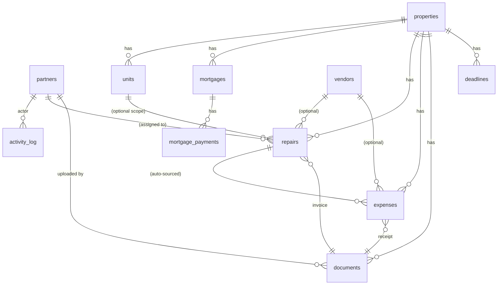

# 3B Holdings Dashboard — Data Model

Full DDL is in `supabase/schema.sql`. This document explains the shape in prose so Claude Design can reason about queries and relationships without parsing SQL.

## Entity relationship diagram



## Tables (11 total)

### Access

**`partners`** — the set of users allowed in. `id` mirrors `auth.users.id`. Role is always `admin` in Phase 1 (the column exists so Phase 2 can add `editor` / `viewer` without a migration).

**`activity_log`** — append-only audit trail. Populated by server-side triggers on every other table. Never written directly by clients. `diff` is JSONB: a full row for create/delete, or a `{before, after}` object for updates.

### Core

**`properties`** — the thing you own. Address, purchase info, current estimated value (manually maintained — `value_updated_at` tracks when you last refreshed it).

**`units`** — rentable subdivisions of a property. A single-family house has one unit labeled "Main". A fourplex has four units.

### Mortgages

**`mortgages`** — one active mortgage per property (schema allows multiple for future refi scenarios). Terms are fixed at creation: `lender`, `original_principal`, `interest_rate` (APR as decimal — 0.055 for 5.5%), `term_months`, `start_date`, `monthly_payment`. `escrow_included` indicates whether `monthly_payment` bundles escrow.

**`mortgage_payments`** — each logged payment. `amount` is the total paid; `principal_portion + interest_portion + escrow_portion` should sum to `amount` (enforced in UI only, so clients compute these when entering). `extra_principal` is additional principal beyond the scheduled payment.

**`mortgage_balances`** (view) — computes `current_balance = original_principal − SUM(principal_portion + extra_principal)` per mortgage. Use this view for "current principal" anywhere.

### Operations

**`vendors`** — contact records. No billing history on the vendor itself; that lives in expenses/repairs linked to the vendor.

**`repairs`** — status flow `open → in_progress → done` (or `cancelled`). `unit_id` is optional (some repairs are property-wide). `vendor_id` and `assigned_to` (a partner) are both optional. `cost` is nullable until done. `invoice_document_id` links to a document in the library.

When a repair is inserted or updated to `status = 'done'` with a non-null `cost` and `completed_date`, a trigger auto-creates an `expenses` row with `category = 'repairs'` and `source_repair_id` pointing back. Guarded so updating an already-done repair doesn't create duplicates.

**`expenses`** — the ledger. `category` ∈ mortgage, insurance, tax, utilities, repairs, hoa, other. `source_repair_id` is non-null only for expenses auto-created from completed repairs.

### Documents

**`documents`** — one row per file. `storage_path` is the key in the `property-documents` Supabase Storage bucket; convention is `{property_id}/{document_id}/{original_filename}`. `category` constrains filing.

### Deadlines

**`deadlines`** — per-property calendar items (insurance renewal, tax due, HOA dues, HVAC service, etc.). `recurring` ∈ `none`, `monthly`, `annually`. When a recurring deadline is marked `completed = true`, a trigger inserts the next occurrence as a new row; the completed row stays as history.

## Triggers

- `repair_to_expense_trigger` on `repairs` — auto-creates an expense when a repair is completed with a cost.
- `deadline_auto_advance_trigger` on `deadlines` — inserts the next occurrence when a recurring deadline is marked complete.
- `log_activity_trigger` on every CRUD table — writes to `activity_log` for every insert/update/delete. Runs with `SECURITY DEFINER` so it bypasses RLS on the audit table. `actor_id` comes from `auth.uid()` (null for non-authenticated operations like seeding).

## Row-Level Security

Every table has RLS enabled. The helper `public.is_partner()` returns true if the caller's `auth.uid()` exists in `partners`. All tables allow full CRUD if `is_partner()` returns true. `activity_log` allows only SELECT (writes come from the trigger, which uses `SECURITY DEFINER` and bypasses RLS). The `property-documents` storage bucket uses the same gate.

## Typical queries

**Portfolio equity:**
```sql
SELECT SUM(p.current_estimated_value - COALESCE(mb.current_balance, 0)) AS total_equity
FROM properties p
LEFT JOIN mortgages m ON m.property_id = p.id AND m.status = 'active'
LEFT JOIN mortgage_balances mb ON mb.mortgage_id = m.id;
```

**Expenses this month:**
```sql
SELECT SUM(amount) FROM expenses
WHERE expense_date >= date_trunc('month', CURRENT_DATE)
  AND expense_date < date_trunc('month', CURRENT_DATE) + INTERVAL '1 month';
```

**Open operations:**
```sql
SELECT r.*, p.address FROM repairs r
JOIN properties p ON p.id = r.property_id
WHERE r.status IN ('open', 'in_progress')
ORDER BY r.opened_date;
```

**Upcoming deadlines:**
```sql
SELECT d.*, p.address FROM deadlines d
JOIN properties p ON p.id = d.property_id
WHERE d.completed = false AND d.due_date <= CURRENT_DATE + INTERVAL '90 days'
ORDER BY d.due_date;
```
